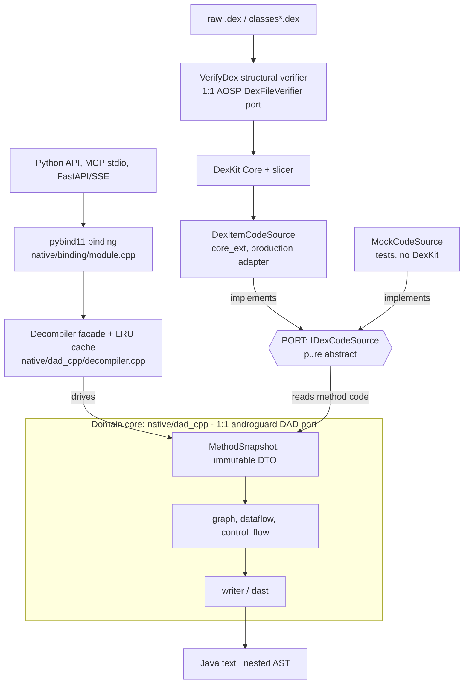

# dex-analyzer-for-llm (`dexllm`)

LLM-facing **Android APK / DEX static analyzer**: a C++ core (pybind11 wrapper around
[LuckyPray/DexKit](https://github.com/LuckyPray/DexKit)) with an embedded, **fully ported
DAD-aligned Java decompiler**, plus MCP and FastAPI/SSE backends for agent integrations.

Built for **mobile threat hunting / malware triage** — fast, low-memory, embeddable, and
parallel-safe — rather than Xposed module development.

## Why

| | dexllm |
|---|---|
| Input | `.apk`/`.jar`/`.zip`, a bare `.dex`, or a disguised/extension-less container — identified by content (PK / `dex\n` magic), not filename; `identify()` probes without loading |
| APK load | ~28 ms (lazy slicer parse + load-time structural verification — ~100× faster than androguard; multiple grows with APK size: Telegram's 39 k classes / 5 dex load in ~120 ms) |
| Decompile | DAD-quality Java; 4.5× faster per-method than androguard |
| Multidex | first-wins duplicate-class resolution, deterministic — matches ART/AOSP, so a packer's class collisions decompile to the body that actually runs |
| Memory | ~520 MB on a 39k-class app — embeddable in-process, no JVM |
| Parallel | C++ releases the GIL → real multi-threaded decompile from one in-process instance |
| Search | L1–L7 (name / string / annotation / super / API call-site / xref) — 3–6× faster than androguard |
| AST | `decompile_method_ast` returns the full androguard `dast.py` nested AST |
| LLM | `dexllm.tools` catalog → MCP stdio server + FastAPI/SSE web backend |

See [docs/workflow.md](docs/workflow.md) for how dexllm operates end to end (load →
verify → search → decompile → agent, all diagrammed),
[docs/usage.md](docs/usage.md) for the full API walkthrough (L1–L7 + decompile),
[docs/architecture.md](docs/architecture.md) for the ports-&-adapters boundary map,
[docs/dexkit-vs-art-dex-handling.md](docs/dexkit-vs-art-dex-handling.md) for how dexllm's
DEX handling compares to AOSP/ART (verification, multidex, cross-dex),
and [CLAUDE.md](CLAUDE.md) for the decompiler port internals.

## Architecture

Hexagonal (ports & adapters): the DAD-aligned decompiler core knows nothing about how
dex bytes are loaded — it talks to the outside through one narrow port (`IDexCodeSource`),
so the same pipeline runs on a real APK (production adapter) or hand-built snapshots
(test adapter). Every byte crosses a load-time structural verifier first.



The boundary is enforced by [`scripts/check_dad_boundary.sh`](scripts/check_dad_boundary.sh):
`native/dad_cpp/` may never `#include` DexKit, FlatBuffers, the zip reader, or `core_ext`.

**Parser lineage** — dexllm parses with Google's **slicer** (`tools/dexter` — a mutable
heap IR built for rewriting, with *no* structural verification, only `SLICER_CHECK`
assertions). ART itself parses with **libdexfile** (lazy zero-copy accessors + its own
`DexFileVerifier`). They are independent AOSP libraries sharing only the dex *format*.
dexllm therefore pairs slicer's parsing with a **1:1 port of ART's `DexFileVerifier`**
(`VerifyDex`, below) and of `utf.cc` (MUTF-8) — slicer's convenience, ART's rigor.

*Why not just use libdexfile?* Because it's a foundation rewrite, not a parser swap:
`dex::Reader` is the backbone of all of DexKit Core (L1–L7 search, enumeration), and
libdexfile isn't standalone-vendorable (it needs libartbase + libbase and builds with
Soong, not CMake). Its one real edge — rigorous verification — we already ported. Full
side-by-side + decision: [docs/dexkit-vs-art-dex-handling.md §0.5](docs/dexkit-vs-art-dex-handling.md).

**Runtime flows** — the load/verify path, the DAD decompile pipeline (`Construct →
BuildDefUse → … → IdentifyStructures → Writer`), the L1–L7 capability ladder, and agent
(MCP/FastAPI) integration are all diagrammed in **[docs/workflow.md](docs/workflow.md)**.

## Malformed-dex verification (vs ART `DexFileVerifier`)

dexllm processes adversarial input, so every dex passes a load-time structural
verifier — `VerifyDex` ([native/core_ext/dex_verifier.h](native/core_ext/include/dex_verifier.h),
the single safety contract) — before the core parses it. A reject throws with a
byte-level reason (`dk.verify_report()`); valid dexes are unaffected. It is a
readable 1:1 port of AOSP ART's `DexFileVerifier` (`// ART :NNNN` anchors,
spec-reference not runtime dep), turned to **crash-safety**, not execution trust.

| Phase (ART `dex_file_verifier.cc`) | vs ART |
|---|---|
| `CheckHeader` / `CheckMap` | ✅ parity — magic/version/sizes/endian, section bounds, map ordering/alignment/required |
| `CheckIntraSection` | ✅ parity — string_data MUTF-8, id indices, type_list, code_item, class_data, encoded_array · **⊕ plus `VerifyInsns`** (per-instruction operand bounds, which ART keeps in the *runtime* method verifier, not the structural one) |
| `CheckInterSection` | ✅ parity — id ordering/uniqueness, descriptor + member-name syntax, class_def semantics (dup / self-inherit / definer-match) |

**Deliberately not checked** — execution-trust mechanics irrelevant to a read-only
analyzer, or out of the structural scope: adler32/SHA-1 checksums, instruction
*dataflow* semantics, annotations, debug_info, call_site/method_handle,
proto shorty-match, access-flag bitmasks, and the offset→map-type cross-check.

**Validated:** clean corpus 0 false-reject · 26/26 C++ test suites · ASan corpus +
malformed-dex fuzz **0 heap-overflow/UAF/SEGV** (the same fuzz segfaults 66/120
with no structural verifier). The verifier adds ~58% to load time (still ~100×
faster than androguard); decompile throughput is unaffected. Full per-check
breakdown: [docs/dexkit-vs-art-dex-handling.md](docs/dexkit-vs-art-dex-handling.md) §1.

## Benchmark vs androguard

dexllm ports androguard's DAD decompiler to C++, so the comparison is pure runtime
(native vs Python) and output parity, **single-threaded, same APK / same methods**.
Reproduce with [`bench/bench_vs_androguard.py`](bench/bench_vs_androguard.py):

```bash
pip install -e ".[dev]"          # dexllm + androguard
python bench/bench_vs_androguard.py /path/to/app.apk
```

**APK:** `com.example.android.tvleanback.apk` — 4135 classes · 500-method decompile sample · single-threaded
(Ryzen 9 9950X, Python 3.13):

| Operation | dexllm | androguard | speedup |
|---|---|---|---|
| APK load (incl. structural verification) | **27.8 ms** | 2.83 s | 102× |
| Decompile — method (500) | **28.4 ms** | 128.9 ms | 4.5× |
| └ per method | **0.06 ms** | 0.26 ms | 4.5× |
| Decompile — whole class (200) | **77.6 ms** | 368.7 ms | 4.8× |
| └ per class | **0.39 ms** | 1.84 ms | 4.8× |
| search: class name `contains "Activity"` | **0.59 ms** | 1.55 ms | 3× |
| search: methods using string `"http"` | **1.95 ms** | 8.28 ms | 4× |
| search: call sites of `Log.d` | **0.27 ms** | 1.22 ms | 5× |

**Java decompile output parity vs androguard** (indent-normalized):
method byte-identical **92.4%** (462/500) · whole-class byte-identical **56.5%** · whole-class
line-overlap **94.0%**. (Byte-identical at class scale is strict — one differing line fails the
whole class; line-overlap is the fairer "how close" measure.) Residual mismatches are
semantic-equivalent (variable-name suffixes) or cases where dexllm emits spec-correct Java that
androguard gets wrong:

- **Unicode strings/identifiers** — dexllm decodes dex MUTF-8 to the exact UTF-16 code units
  ART builds in a `mirror::String` (decoder ported 1:1 from `art/libdexfile/dex/utf-inl.h`),
  emitting readable UTF-8 for BMP text (한글/CJK) and a `\uXXXX` escape only for surrogates/control
  chars. A supplementary (astral) char is kept as a **surrogate pair**, exactly like ART. androguard
  DAD instead emits one `\u` followed by the full codepoint hex — e.g. a real-corpus `U+DFFFD` comes
  out as `"\udfffd"` (**5 hex digits → invalid Java**: the lexer reads `\udfff` + a literal `d`,
  silently corrupting the string), where dexllm emits the valid `"\udb3f\udffd"`. (Verified against
  the actual AOSP source — see [docs/dexkit-vs-art-dex-handling.md](docs/dexkit-vs-art-dex-handling.md).)
- **Literals** — boolean `return false/true` (not `return 0/1`), `return null` for a null reference,
  IEEE-754 `float`/`double` literals (`1.0f`, `Double.NaN`) where androguard prints the raw integer
  bits, and `null`/`true`/`false` field initializers (not Python `None`/`True`/`False`).

**Parallel decompile** — dexllm releases the GIL in `decompile_*`, so threads give real
parallelism on one shared instance; androguard cannot use threads at all (GIL + non-thread-safe
analysis). Full-APK decompile of the same 4135 classes:

| dexllm | wall | speedup |
|---|---|---|
| sequential (1 thread) | 1.85 s | 1.0× |
| 32 threads (shared instance) | **188 ms** | **9.9×** |

Speedup is workload-dependent. Here it peaks at **~10.5× near the 16 physical cores** (Ryzen 9
9950X is 16C/32T); the 32 logical (SMT) threads regress slightly to ~9.9× from scheduler
contention, so `bench_vs_androguard.py` (which uses `os.cpu_count()` = 32) reports the 32-thread
figure above. On a 39k-class app the speedup drops to ~3× because returning hundreds of MB of
decompiled text becomes GIL-bound. The APK-load gap instead widens with size: that 39k-class /
5-dex app loads in ~120 ms (lazy slicer parse + linear structural verification) versus
androguard's multi-second whole-program analysis.

**Each tool at its realistic max** — dexllm parallel (32 threads) vs androguard single-threaded
(its *only* mode), full-APK decompile, end-to-end:

| stage | dexllm (parallel) | androguard (single) | speedup |
|---|---|---|---|
| APK load (incl. structural verification) | 27.8 ms | 2.78 s | 100× |
| full decompile (4135 classes) | **188 ms** | 9.91 s | 53× |
| **END-TO-END** | **0.22 s** | 12.69 s | **59×** |

## Repository layout

```
.
├── pyproject.toml          scikit-build-core build config
├── CMakeLists.txt          native build (drives vendor/ + native/)
├── src/dexllm/             Python package: DexKit, tools, mcp_server, server, capability, …
├── native/                 C++ sources
│   ├── core_ext/             extension over upstream DexKit (search / ref enumeration)
│   ├── dad_cpp/              DAD-aligned Java decompiler (graph/dataflow/control_flow/writer/dast)
│   └── binding/              pybind11 module (C++ ↔ Python boundary)
├── tests/                  C++ parity suites (tests/parity, ctest) + Python pytest suite
├── examples/               runnable usage examples
├── bench/                  reproducible androguard benchmark
├── docs/                   detailed API walkthrough (usage.md)
├── vendor/dexkit_core/     vendored LuckyPray DexKit Core (its own LICENSE)
├── test_apk/               APK corpus for regression (fetched separately; gitignored)
├── CLAUDE.md               decompiler port internals / dev notes
└── LICENSE                 Apache-2.0
```

## Install

### Pre-built wheels (recommended — no toolchain)

Wheels for **Linux** (`manylinux_2_28` x86_64) and **macOS** (x86_64 + arm64, requires
macOS 13.3+), CPython 3.9–3.13, are attached to this repo's
[Releases](https://github.com/mobile-threat-hunter/dex-analyzer-for-llm/releases).
`pip` picks the wheel matching your platform/Python — no C++ compiler needed:

```bash
pip install dexllm --find-links https://github.com/mobile-threat-hunter/dex-analyzer-for-llm/releases/expanded_assets/v0.1.4
# + LLM backends (MCP + FastAPI); the extra deps resolve from PyPI:
pip install "dexllm[all]" --find-links https://github.com/mobile-threat-hunter/dex-analyzer-for-llm/releases/expanded_assets/v0.1.4
```

(Or download a specific `.whl` from the [Releases page](https://github.com/mobile-threat-hunter/dex-analyzer-for-llm/releases) and `pip install ./that-file.whl`.)

### Build from source (development)

Requirements: Python 3.9+ and a **C++20 compiler**. CMake / Ninja / pybind11 / scikit-build-core
are build-time deps that `pip` provisions automatically — you don't install them by hand.

- **Linux**: GCC 10+ or Clang 12+, plus `zlib` dev headers (`apt install build-essential zlib1g-dev`).
- **macOS** (Intel or Apple Silicon): Xcode Command Line Tools (`xcode-select --install`) — provides
  Apple Clang (C++20 from Xcode 14+) and the system `zlib`. No Homebrew packages required. The build
  is platform-agnostic (scikit-build-core resolves the wheel tag per OS/arch).

```bash
# from the repo root — same on Linux and macOS
pip install -e .                 # core (native analyzer + decompiler)
pip install -e ".[all]"          # + MCP server + FastAPI backend
pip install -e ".[dev]"          # + pytest + androguard (for tests / parity)
```

After editing C++ sources, rebuild with the two-step loop (or `/dexkit-build`):

```bash
cd build/cp*-cp*-* && ninja      # 1. rebuild the native lib
cd - && pip install -e . --no-build-isolation   # 2. reinstall from repo root
```

## Quick start

```python
import dexllm

# Probe a file by content without loading it (handles disguised/extension-less APKs)
dexllm.identify("/path/to/suspect")   # → {format, is_apk, has_manifest, dex_count}

dk = dexllm.DexKit("/path/to/app.apk")   # .apk/.jar/.zip, a bare .dex, or a disguised container

# What framework APIs does it touch? (capability / threat triage)
for ref in dk.list_external_method_refs(framework_only=True)[:10]:
    print(ref.java_signature)

# Decompile
print(dk.decompile_method_java("Lcom/example/Foo;->bar()V"))
print(dk.decompile_class_java("Lcom/example/Foo;"))
ast = dk.decompile_method_ast("Lcom/example/Foo;->bar()V")   # nested AST + Java text

# Search
for m in dk.find_methods_using_strings(["http"]):
    print(m)
for site in dk.find_call_sites_to_api("Landroid/util/Log;->d(Ljava/lang/String;Ljava/lang/String;)I"):
    print(site)
```

LLM backends (need the `[all]` extra):

```bash
python -m dexllm.mcp_server                 # MCP stdio (Claude Desktop / Cursor / Continue)
uvicorn dexllm.server:app --port 8000       # FastAPI + SSE web backend
```

## Tests

```bash
# C++ parity suites (self-contained, no APK needed) — primary regression gate
cd build/cp*-cp*-* && ninja parity_tests && ctest --output-on-failure

# Python suite (skips APK-dependent tests if no APK is available)
pip install -e ".[dev]"
DEXLLM_TEST_APK=/path/to/app.apk pytest tests -v
```

See [tests/README.md](tests/README.md) for details.

## Licence

Apache-2.0 — see [LICENSE](LICENSE). Vendored DexKit Core under `vendor/dexkit_core/` keeps its
own licence ([vendor/dexkit_core/LICENSE](vendor/dexkit_core/LICENSE)).
