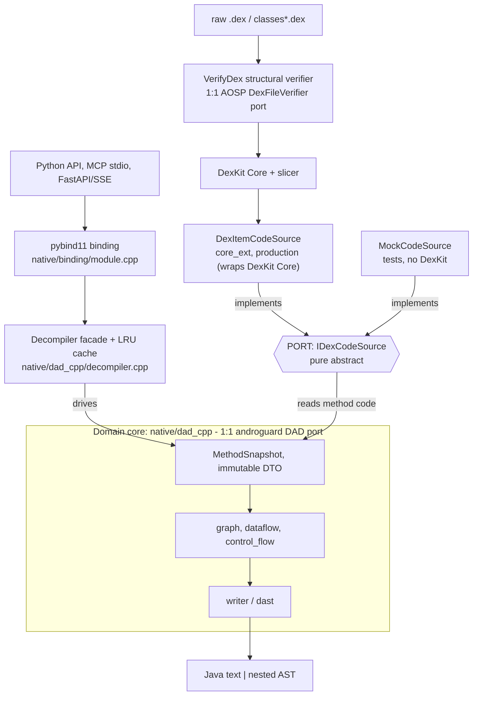

# Architecture — ports & adapters

The decompiler already follows a **hexagonal (ports & adapters)** shape at the
boundary that matters: a domain core that knows nothing about how dex bytes are
loaded, talking to the outside world through one narrow port.



The same structure in detail (text fallback):

```
        ┌─────────────────── driving (primary) adapter ─────────────────┐
        │  native/binding/module.cpp        pybind11  C++ ↔ Python       │
        │  native/dad_cpp/decompiler.cpp    Decompiler facade + cache    │
        └───────────────────────────────┬───────────────────────────────┘
                                        │ drives
   ┌─────────────────────────────────────▼─────────────────────────────────┐
   │  DOMAIN CORE  —  native/dad_cpp/                                        │
   │                                                                        │
   │    MethodSnapshot (DTO)  →  graph → dataflow → control_flow            │
   │                          →  writer / dast  →  Java text | AST          │
   │                                                                        │
   │  Depends only on: the C++ stdlib, its own headers, the slicer dex      │
   │  value types (slicer/dex_*.h), and the IDexCodeSource port.            │
   │  Zero dependency on DexKit, FlatBuffers, the zip reader, or core_ext.  │
   └─────────────────────────────────────┬─────────────────────────────────┘
                                        │ depends on (points inward)
                        ┌────────────────▼─────────────────┐
                        │  PORT  —  IDexCodeSource          │
                        │  native/dad_cpp/include/          │
                        │      dex_code_source.h  (pure =0) │
                        └───────┬───────────────────┬───────┘
                  implements    │                   │   implements
        ┌──────────────────────▼───┐      ┌─────────▼────────────────────────┐
        │ DexItemCodeSource         │      │ MockCodeSource                    │
        │ native/core_ext/          │      │ native/dad_cpp/                   │
        │   production — wraps the   │      │   tests — hand-built snapshots,   │
        │   real DexKit Core         │      │   no DexKit needed                │
        └────────────────────────────┘      └───────────────────────────────────┘
```

## The three roles

| Role | What | Where |
|---|---|---|
| **Port** (driven) | `IDexCodeSource` — the only interface the domain uses to read method code, strings, types, and to locate methods. Pure abstract (`= 0`). | [native/dad_cpp/include/dex_code_source.h](../native/dad_cpp/include/dex_code_source.h) |
| **Adapters** | `DexItemCodeSource` (production, wraps `dexkit::DexKit`) and `MockCodeSource` (tests). Both implement the port. | [core_ext/include/dexitem_code_source.h](../native/core_ext/include/dexitem_code_source.h), [dad_cpp/include/mock_code_source.h](../native/dad_cpp/include/mock_code_source.h) |
| **Domain core** | The DAD-aligned decompiler pipeline: graph / dataflow / control_flow / writer / dast. Consumes a `MethodSnapshot` DTO, emits Java text or the nested AST. | [native/dad_cpp/](../native/dad_cpp/) |
| **DTO** | `MethodSnapshot` — immutable, pointer-stable per-method snapshot (meta + decoded instructions + CFG blocks). The data the port hands across the boundary. | [native/dad_cpp/include/method_snapshot.h](../native/dad_cpp/include/method_snapshot.h) |

The payoff is concrete, not theoretical: because the domain only knows the port,
`MockCodeSource` lets the 25 DAD parity suites exercise the full pipeline **without a
real APK or DexKit** — the same property hexagonal architecture exists to provide.

## Load-time verification — anti-corruption at the input boundary

dexllm processes adversarial input, so before any dex reaches the core (let alone
the domain) the production load path screens it with a self-contained structural
verifier, `VerifyDex` ([native/core_ext/dex_verifier.h](../native/core_ext/include/dex_verifier.h)).
`DexKitExt` runs it on every raw `.dex` and every `classes*.dex` extracted from an
apk **before** `AddImage` hands the bytes to the DexKit Core / slicer — a reject
throws with a byte-level reason (surfaced by `dk.verify_report()`), so malformed or
crafted input never reaches the parser.

It mirrors the boundary invariant from the input side: like `dad_cpp`, the verifier
depends only on the slicer dex value types (`slicer/dex_format.h`, `dex_bytecode.h`)
— no DexKit, FlatBuffers, or zip internals — so it is testable and auditable in
isolation. It is a readable 1:1 port of AOSP ART's `DexFileVerifier`, scoped to
**crash-safety** (never crash the analyzer on malformed input) rather than the
execution trust ART needs. Because it owns structural validity at the boundary, the
decode / IR paths downstream may assume verified input and drop their own redundant
bounds guards. Full per-check breakdown + the ART comparison:
[dexkit-vs-art-dex-handling.md](dexkit-vs-art-dex-handling.md) §1.

## The boundary invariant

> `native/dad_cpp/` must never `#include` DexKit Core, FlatBuffers schema, the zip
> reader, or `core_ext`. Anything it needs from the outside arrives through
> `IDexCodeSource`.

The slicer dex types (`slicer/dex_*.h`) are the one allowed inward dependency
beyond the stdlib — they are the shared *vocabulary* of the dex format (the value
types the port itself speaks, e.g. `const dex::Code*`), not an infrastructure
adapter.

Enforced by [scripts/check_dad_boundary.sh](../scripts/check_dad_boundary.sh):

```bash
./scripts/check_dad_boundary.sh   # exits non-zero on any leak
```

## Why we don't push hexagonal *deeper* into `dad_cpp`

The domain core is a **1:1 faithful port of androguard DAD** — every function
carries a `// DAD: <file.py>:<lineno>` trace, and the 25 DAD parity suites assert
byte-identical output so the port can be re-synced against DAD upstream.

Splitting the *internal* pipeline (graph / dataflow / writer) into further
domain/application/infrastructure layers would break that `// DAD:` traceability
and risk parity, for no real gain: the inner pipeline is a pure
`DTO → transforms → text` computation with no external I/O to isolate. Hexagonal
architecture earns its keep when there are many swappable integrations to keep at
arm's length; here there is exactly one (the dex data source), and it is already
behind the port. Adding more ports inside would be ceremony, not clarity.
