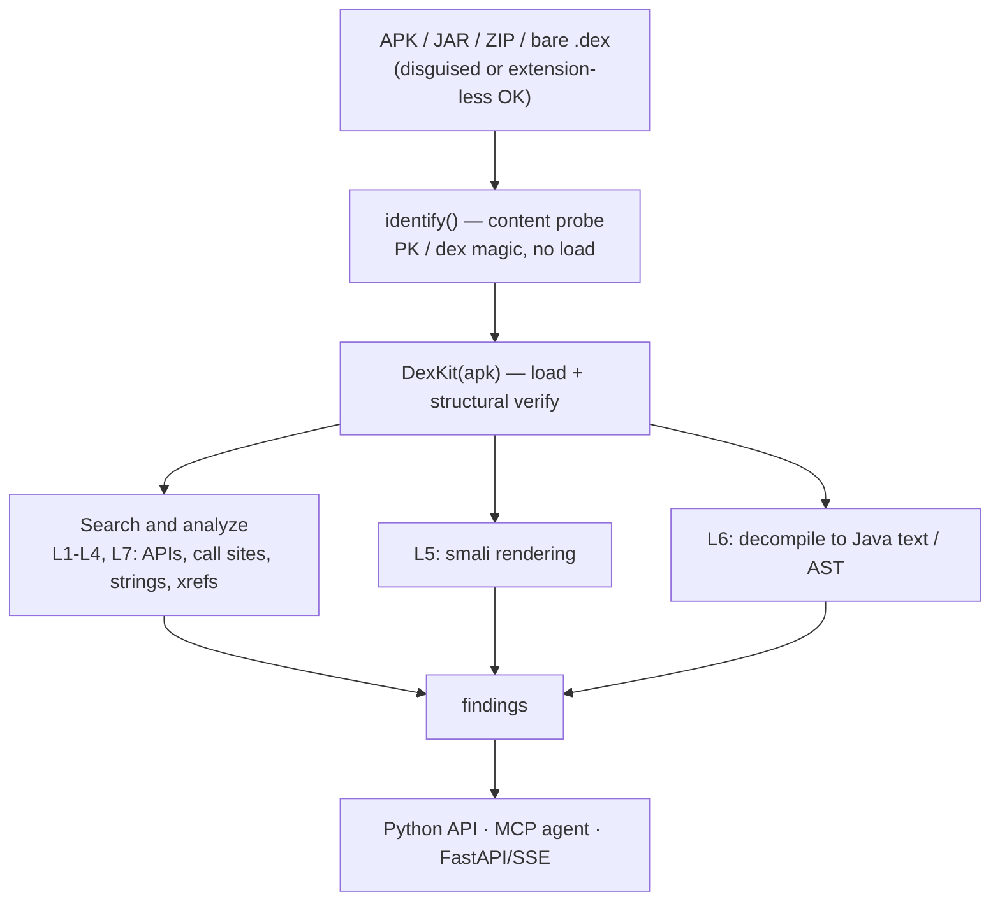
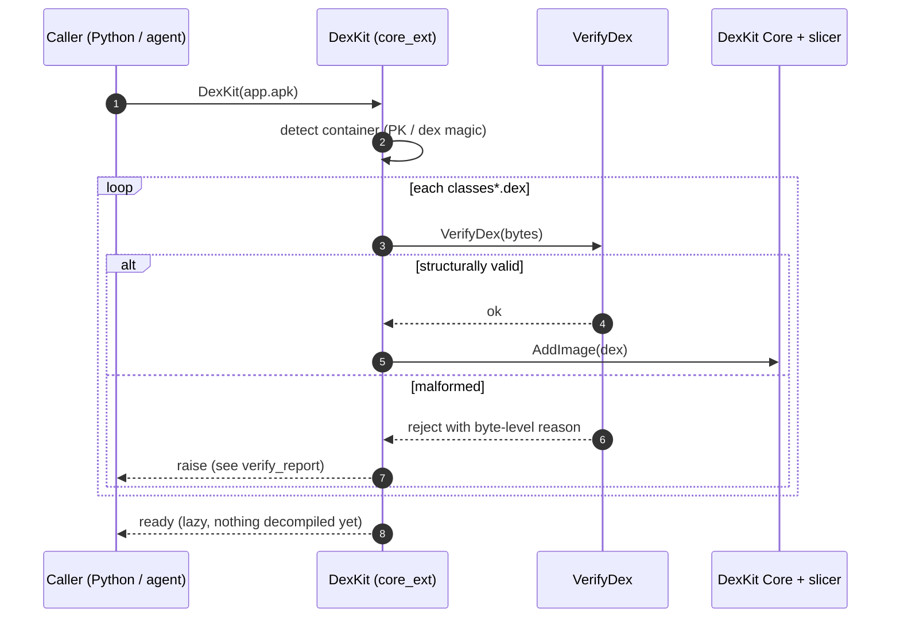
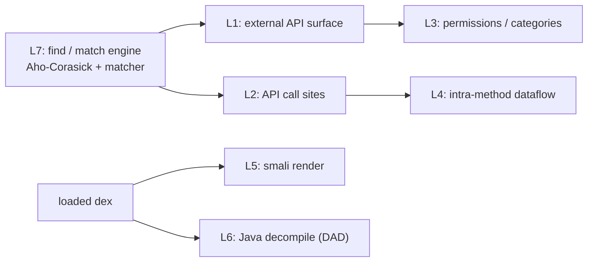
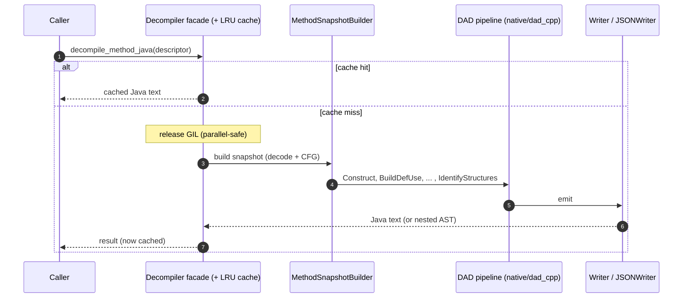
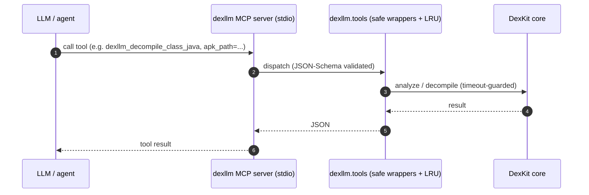

# Workflow — how dexllm operates, end to end

This is the **runtime view**: the flows a caller actually drives, from a file on
disk to findings or decompiled Java. For the *static* structure (the ports &
adapters boundary, where each piece lives) see [architecture.md](architecture.md);
for the API call recipes see [usage.md](usage.md).

All diagrams render on GitHub (Mermaid).

## 1. The big picture

A single in-process instance loads once, then serves many lazy analyses. Nothing
is decompiled until asked; results are cached.

## 2. Load and verify

The constructor identifies the container by **content, not filename**, then gates
**every** dex through the structural verifier before the core parses it. A
malformed dex is rejected with a byte-level reason; siblings in the same apk still
load. The load is lazy — no method is decompiled yet.

See [dexkit-vs-art-dex-handling.md](dexkit-vs-art-dex-handling.md) for the
verifier's per-check parity with AOSP ART `DexFileVerifier`.

## 3. The capability ladder (L1-L7)

`L` = **capability level** — a numbered grouping, not a strict abstraction
hierarchy. One search engine (L7) underpins the higher-level analyses (L1–L4);
L5/L6 are the render/decompile paths. Each level is independently callable.

| Level | Question it answers | Entry point |
|---|---|---|
| L1 | which Android framework APIs does this APK touch? | `find_used_apis` / class summary |
| L2 | where is a specific API called? | `find_call_sites_to_ref` |
| L3 | which permissions / categories are exercised? | permission mapping |
| L4 | what is actually passed at each call site? | intra-method dataflow |
| L5 | smali for a method/class (no JVM) | smali render |
| L6 | DAD-quality Java text / AST | `decompile_method_java` / `_class_java` / `_method_ast` |
| L7 | find classes/methods by name/string/literal/super/annotation | `find_*` family |

Full recipes: [usage.md](usage.md).

## 4. Decompile a method (L6)

The hot path. A cache hit returns immediately; a miss runs the DAD pipeline with
the **GIL released**, so many threads decompile in parallel on one shared instance.

The pipeline passes, each mirroring androguard `decompile.py:DvMethod.process`:

```mermaid
flowchart LR
    A["method<br/>descriptor"] --> B["DexItemCodeSource<br/>locate"]
    B --> C["MethodSnapshotBuilder<br/>decode, CFG, snapshot"]
    subgraph pipe["DAD IR pipeline: native/dad_cpp"]
        D["Construct"] --> E["BuildDefUse"] --> F["SplitVariables"] --> G["DeadCodeElimination"]
        G --> H["RegisterPropagation"] --> I["PlaceDeclarations"] --> J["SplitIfNodes"]
        J --> K["Simplify"] --> L["IdentifyStructures"]
    end
    C --> D
    L --> W["Writer / JSONWriter"]
    W --> O["Java text | AST"]
```

The text path (`Writer`) and AST path (`JSONWriter`/`dast`) share the same
processed graph but emit differently; `decompile_method_ast(include_source=False)`
skips the text emit for ~1.7x faster AST-only consumers.

## 5. Driving it from an agent (MCP / FastAPI)

Every entry in `dexllm.tools` is exposed as one MCP tool (stdio) and over the
FastAPI/SSE backend. MCP calls are stateless, so each tool takes an `apk_path`;
the server keeps an LRU of loaded instances. Decompile tools go through the **safe
wrappers** — a hung method returns a `// TIMEOUT` marker instead of locking the
server.

## Where to go next

- [usage.md](usage.md) — concrete API calls for every level above.
- [architecture.md](architecture.md) — the static ports & adapters structure.
- [dexkit-vs-art-dex-handling.md](dexkit-vs-art-dex-handling.md) — verification,
  multidex, and MUTF-8 vs AOSP/ART.
- [CLAUDE.md](../CLAUDE.md) — the decompiler port internals.
